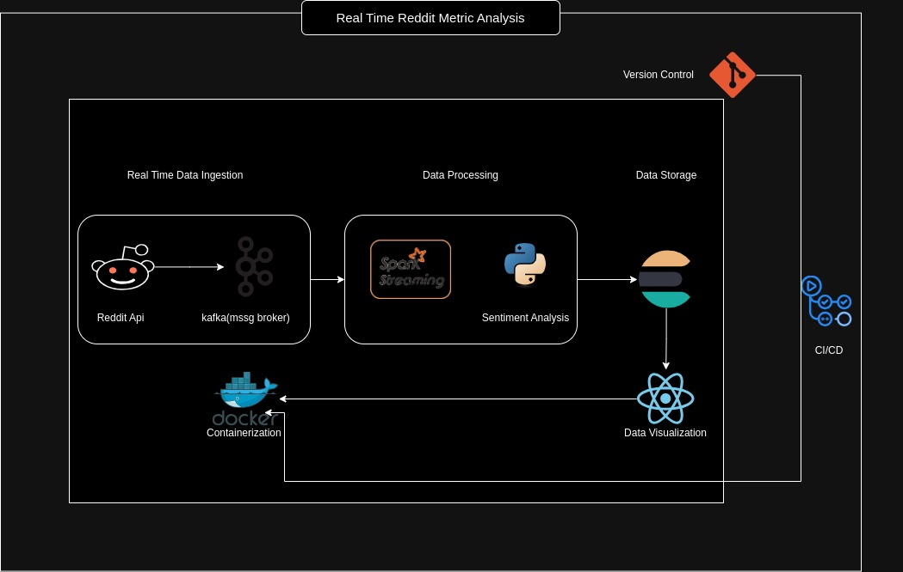

# Reddit-metric-analysis
This project is still on-going, yes i didsn't wanna use kibana or grafana and did this witch craft. I wanna challenge myself :)

## Story of this project
Woke up one day and wainted to know the most discussed content in Morocco, jottet down the initial architecture and got to work. However i always wanted to try the Three.js lib (it' a 3D lib) even if i ain't proficient in dev so i took this as a chance to try it.

In more put together words:
- This project analyzes Reddit metrics to provide insights into user engagement and content popularity in each country.

## Data Architecture Diagram
Below is the data architecture diagram that illustrates how the pipeline functions:



## Tools
* Kafka
* Elasticsearch
* Docker
* spark
* PRAW (Python Reddit API Wrapper)

## Data Pipeline Overview
1. **Data Ingestion**: Reddit data is ingested using PRAW.
2. **Data Processing**: Spark processes the ingested data.
3. **Data Storage**: Processed data is stored in Elasticsearch.
4. **Data Visualization**: Three.js is used for 3D visualization of the data.
5. **Containerization**: Docker is used to containerize the various components of the project, ensuring consistency across different environments,here the frontend and backend.
6. **Version Control**: Git is used for version control( i love git, push your projects into git people)
7. **CI/CD**: GitHub Actions is used for continuous integration and continuous deployment, automating the build, test, and deployment processes(i aint using jenkins).

## Things to take into consideration to run the project locally
- Make sure to replace the Reddit api configurations with yours on praw_config.py
- Ensure you have Docker and Docker Compose installed on your machine.
- Clone the repository to your local machine.
- Navigate to the project directory.
- Run `docker-compose up` to start the services.
- Verify that all services are running correctly.
- Access the application via the provided URL.
- Refer to the `docker-compose.yml` file for any service-specific configurations.
- You'll see that in the `docker-compose.yml` file i didn't include all the services and images to pull, that's because I installed them locally on my machine and not as images. If it's not your case, then each service should be looking like this:
```yaml
  zookeeper:
    image: wurstmeister/zookeeper:3.4.6
    ports:
      - "2181:2181"
    pull_policy: "never"
```
The `pull_policy: "never"` if you already got the on your machine as images and don't want them to be pulled by mistake, if not feel free to remove tis parameter.

- If you want the ci/cd pipline using github actions refer to the `.github` dir you'll find the yml file there, just replace with your credentials for Dockerhub (if you find it still in fiasco then i'm still working on it :))